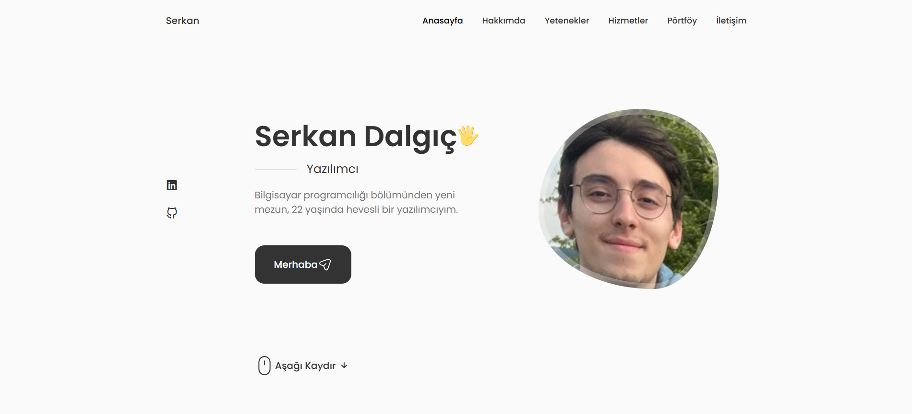
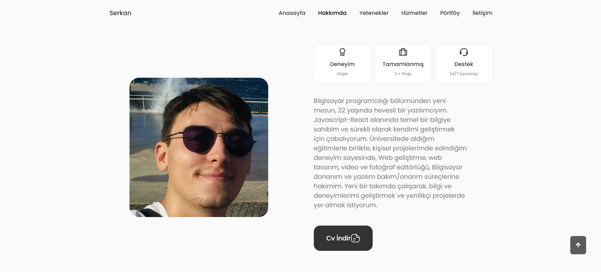
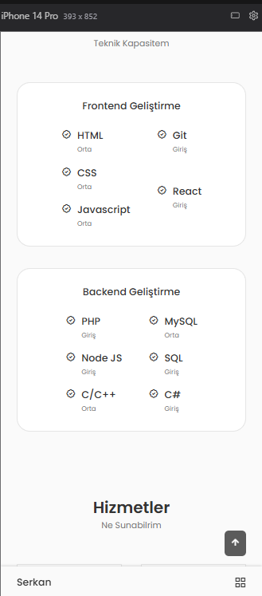
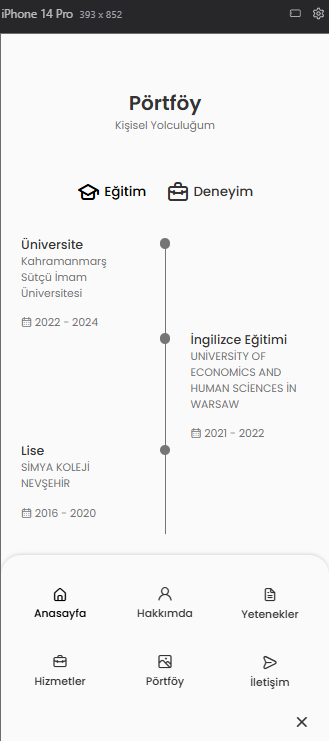
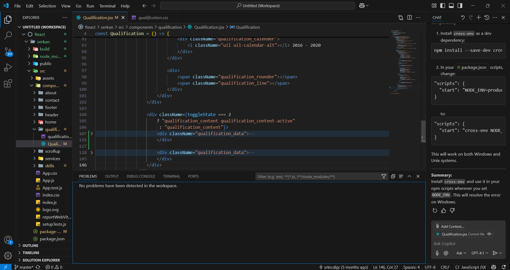

# 🌐 Serkan Dalgıç — Kişisel Portfolyo Sitesi

HTML, CSS, JavaScript ve **React.js** ile geliştirilmiş, tek sayfalık (single-page) kişisel portfolyo web sitesi.

🔗 **Canlı demo:** [react-portfolio-tau-two-15.vercel.app](https://react-portfolio-tau-two-15.vercel.app/)

---

## 🛠️ Kullanılan Teknolojiler


## ✨ Özellikler

- **Hakkımda** — Kişisel tanıtım ve indirilebilir CV butonu
- **Yetenekler** — Frontend (HTML, CSS, JavaScript, Git, React) ve Backend (PHP, Node.js, C/C++, MySQL, SQL, C#) becerilerinin görsel sunumu
- **Hizmetler** — Sunulan hizmetlerin (UI/UX Tasarım, Görsel Tasarım) detaylı açıklamalarıyla birlikte modal pencereler üzerinden gösterimi
- Tamamen **responsive** (mobil/tablet/masaüstü uyumlu) tasarım
- React component yapısı ile modüler kod organizasyonu

## 🖼️ Ekran Görüntüleri

### Ana Sayfa


### Hakkımda & Yetenekler




### Geliştirici Konsolu


## 🚀 Kurulum ve Çalıştırma

```bash
git clone https://github.com/srkngthb16/ReactPortfolio.git
cd ReactPortfolio
npm install
npm start
```

Tarayıcıda `http://localhost:3000` adresinden görüntüleyebilirsiniz.

## 📁 Proje Yapısı

```
src/
├── components/
│   ├── about/      → Hakkımda bölümü
│   ├── home/       → Ana sayfa / hero alanı
│   ├── services/   → Hizmetler bölümü
│   ├── skills/     → Frontend & Backend yetenek kartları
│   └── footer/     → Alt bilgi ve sosyal medya bağlantıları
```

## 📬 İletişim

- **LinkedIn:** [Serkan Dalgıç](https://www.linkedin.com/in/serkan-dalg%C4%B1%C3%A7-37583b377/)
- **GitHub:** [@srkngthb16](https://github.com/srkngthb16)

---

*Bu proje, kişisel becerilerimi sergilemek amacıyla geliştirilmiştir ve sürekli geliştirilmeye açıktır.*